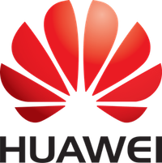

The Mathematical Coffees is a joint series of seminars organized jointly by [Fondation Sciences Mathématiques de Paris](http://www.sciencesmaths-paris.fr/) and [Huawei](http://www.huawei.com). It is privately held at [Huawei research lab in Paris](https://www.huawei.eu/research-and-innovation), but the material (slides and computational resources) is freely available on this webpage.  

The list of the 10 Mathematical Coffees for 2017, with all the materials for those that have been done, [is available here](./listing).

List of Speakers
-----

- [Alexandre Allauzen](https://perso.limsi.fr/allauzen/webpages/pmwiki.php), Paris-Sud.
- [Pierre Alliez](https://team.inria.fr/titane/pierre-alliez/), INRIA.
- [Guillaume Charpiat](https://www.lri.fr/~gcharpia/), INRIA.
- [Emilie Chouzenoux](http://www-syscom.univ-mlv.fr/~chouzeno/), Paris-Est.
- [Nicolas Courty](http://people.irisa.fr/Nicolas.Courty/), IRISA.  
- [Laurent Cohen](https://www.ceremade.dauphine.fr/~cohen/), CNRS and Paris-Dauphine.  
- [Marco Cuturi](http://marcocuturi.net/), ENSAE.
- [Julie Delon](https://delon.wp.imt.fr/), Paris 5.  
- [Jalal Fadili](https://fadili.users.greyc.fr/), ENSICaen.  
- [Alexandre Gramfort](http://alexandre.gramfort.net/), Telecom ParisTech.  
- [Matthieu Kowalski](http://webpages.lss.supelec.fr/perso/matthieu.kowalski/), Supelec.
- [Jean-Marie Mirebeau](https://www.math.u-psud.fr/~mirebeau/Main_page.html), CNRS and Paris-Sud.  
- [Fabian Pedregosa](http://fa.bianp.net/), INRIA.
- [Julien Tierny](http://www-pequan.lip6.fr/~tierny/), CNRS and Paris 6.  
- [Robin Ryder](https://sites.google.com/site/robryd/), Paris-Dauphine.  
- [Gael Varoquaux](http://gael-varoquaux.info/), INRIA.

Organizers
-----

- [Mérouane Debbah](mailto:merouane.debbah at huawei.com), Huawei.
- [Gabriel Peyré](http://www.gpeyre.com), CNRS and ENS.

Sponsors
-----
&nbsp;&nbsp;&nbsp;&nbsp;
&nbsp;&nbsp;&nbsp;&nbsp;

&nbsp;&nbsp;&nbsp;&nbsp;
&nbsp;&nbsp;&nbsp;&nbsp;

